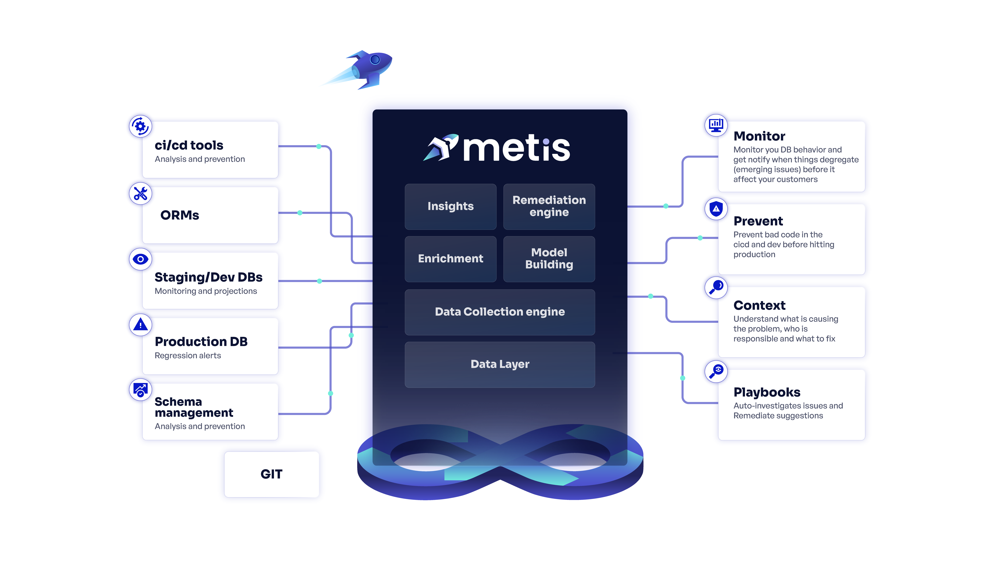

# What is Metis?

Metis is a database guardrails solution. Metis empowers developers and teams to **own their databases.** No matter their expertise,with Metis you can **prevent** issues from reaching production, **proactively monitor** your DB and **troubleshoot** with context when needed

Metis is a **database observability tool** that enables you to understand the efficiency of your database and its interactions. Metis collects database performance data, analyzes it, **tells you what's wrong** and **how to fix it**.

<figure><figcaption></figcaption></figure>

## From Observability to Understanding

> _Observability: "The ability to measure the internal states of a system by examining its outputs."_

Database observability is the practice of **monitoring** and **understanding** the behavior of a database system in order to identify and resolve issues that could impact its performance or availability. \
It involves collecting and analyzing data from multiple sources, such as metrics, logs, traces, databases schema, table size, indexes usage, execution plans, and database configuration. The collected data, from both the production and dev environments, is used to gain insights into its operation and to detect anomalies, errors, or performance bottlenecks. \
By providing visibility into the database system's behavior, observability helps database administrators and developers **proactively** optimize and troubleshoot their applications, reduce downtime, and improve their database infrastructure's overall reliability and efficiency.


Metis **refrains from collecting any sensitive information**, such as the parameters used in executing SQL commands or the data contained within the returned rows of a query.


## DB-related Software Lifecycle Development

Metis works with you in every step of your software lifecycle development.&#x20;

<figure><figcaption></figcaption></figure>

A typical software lifecycle, **from the database perspective**:

- **Planning and Design**
- **Development on the local environment**: In this stage, the user writes the code, tests it, and integrates it with other components. The database of the local / dev environment is usually tiny and used for unit tests.
- **Testing on Staging Environment**: Once the development is complete, the software is deployed to a staging environment where testing can be performed. This is a non-production environment that mimics the production environment where the software will ultimately be deployed. The purpose of this stage is to identify and fix any issues or bugs that may exist in the software before deploying it to production. \
  For every Pull Request Metis can:&#x20;
  - Performance analysis - of every SQL command generated during the PR. The engine also applies smart projections using the production environment metadata.
  - Schema Migration analysis - how changes in the database schema might affect the deployment.
  - Database schema analysis - general review of violation of best practices
- **Deployment:** Once the software has been tested and verified on the staging environment, it is deployed to the production environment.&#x20;
- **Observability:** Once the software has been deployed to production, it is important to monitor it to ensure that it is working as expected. This includes monitoring the database performance, application errors (when the root cause is the database), and data quality problems.&#x20;

At Metis, we aim to provide powerful database insights and communicate them in the simplest way.
