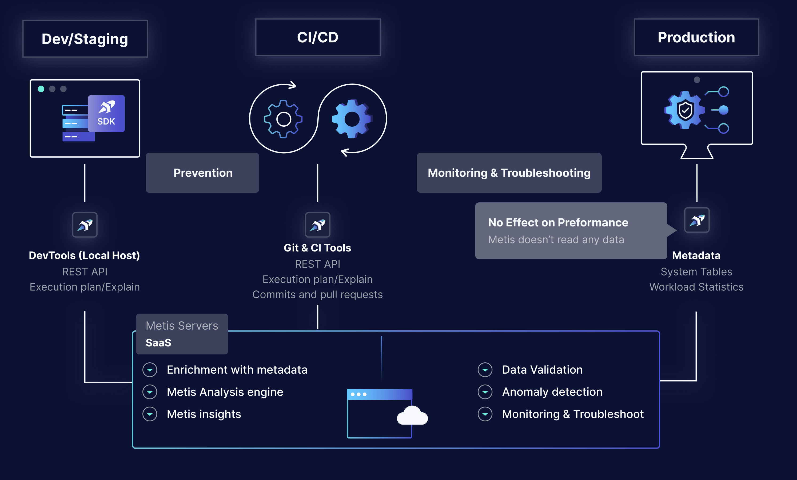

# Metis Overview

## What is Metis

Today’s developers and devops teams need better tooling and self-service guardrails in order to move fast with confidence. Those tools needs to integrate with the modern workflow, allow quick troubleshooting and provide rich context.

Metis is a database guardrails solution. Metis empowers developers and teams to own their databases, No matter their expertise.

With Metis you can prevent issues from reaching production, proactively monitor your DB and troubleshoot with context when needed.

## The 3 Pillars of Metis

Metis platform is built on 3 pillars:

### Prevention

Prevent your database code from breaking production by detecting DB-related problems during the development and CI/CD, before the new code is deployed to the production environment.

### Monitoring

Advanced monitoring of the production environment. Collect and organize information about performance, schema, and configuration. The users can view the data in dashboards.

### Troubleshooting

Get clear insights about the root cause and all the relevant context for quickly solving the problems.   

## Live Demo
Visit our [Live Demo](https://demo.metisdata.io/projects/) to see Metis in action. 

## Real-World Examples
- A query is inefficient, it scans large tables. The IO is a bottleneck that affects the system.

- A new version of the app changed the schema and accidentally deleted an index, which caused many queries to perform slowly.

- A query used to work fine for a long time. But as the amount of data in the db grows, the query becomes slower.

- Many temp files are created when the queries sort the data, which makes the IO a bottleneck.

- The allocated amount of memory is simply not enough to support the workloads.

- The statistics of the tables aren’t up to date. As a result, the query optimizer generates suboptimal plans.

## Quick start

Metis’s Quick start takes around 5 minutes.

By the end of it you will have a good basic understanding of how Metis works.
