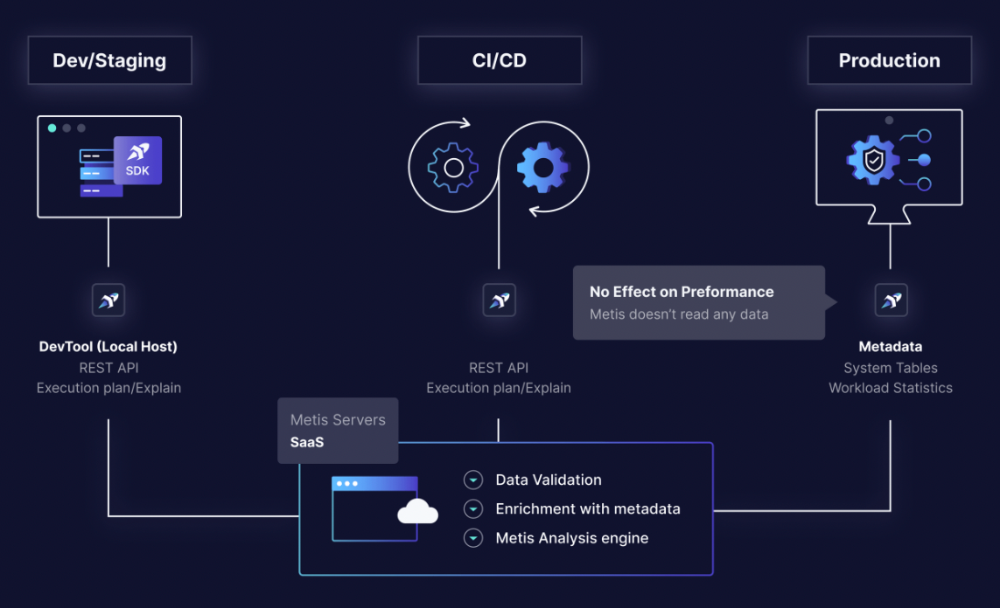

# Metis Overview

## What is Metis

Metis collects database performance data, analyzes it, **tells you what's wrong** and **how to fix it**.

Metis is a database guardrails solution. Metis empowers developers and teams to **own their databases,** No matter their expertise.

With Metis you can **prevent** issues from reaching production, **proactively monitor** your DB and **troubleshoot** with context when needed

Update image

## **The 3 Pillars of Metis**

Metis platform is built on 3 pillars:

\***\*Prevention\*\***

Prevent your database code from breaking production by detecting DB-related problems during the development and CI/CD, before the new code is deployed to the production environment.

[Link](https://demo.metisdata.io/projects/5KauFohR2zaOxXLN2EimDmZEHRBTwKX4DG8E1wR5/activities) to Live Demo

\***\*Monitoring\*\***

Advanced monitoring of the production environment. Collect and organize information about performance, schema, and configuration. The users can view the data in dashboards.

Link to Live Demo

\***\*Troubleshooting\*\***

Get clear insights about the root cause and all the relevant context for quickly solving the problems.

Link to Live Demo

## Quick start

Metis’s Quick start takes around 5 minutes.

By the end of it you will have a good basic understanding of how Metis works.

Link to [TL;DR - Quickstart! (work in progress)](https://www.notion.so/TL-DR-Quickstart-work-in-progress-5eef6befd8524c56a3d0176ad51912a9?pvs=21)
