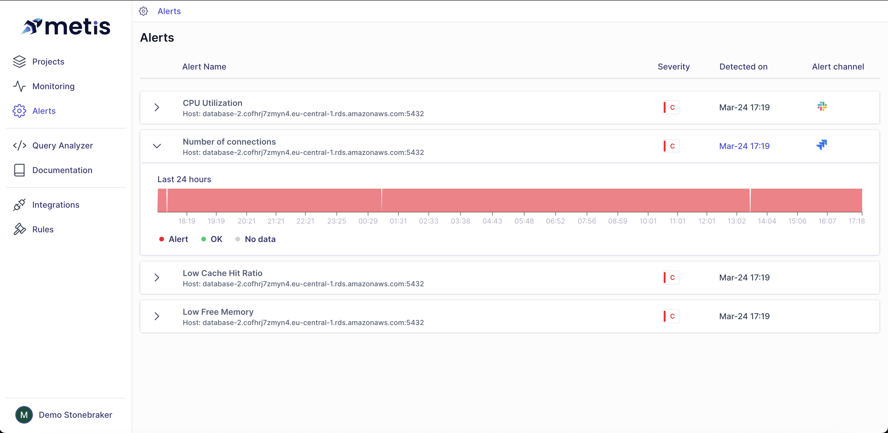
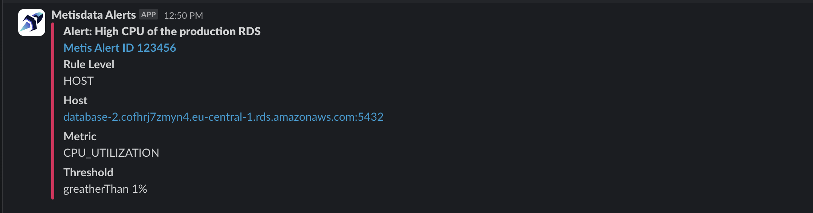

# Alerts and notifications

## Alerts in Database Observability

Alerts are essential for enhancing the reliability of database environments and improving time-to-resolution for issues. They enable proactive issue detection, minimizing downtime, optimizing performance, and ensuring smooth operations. By leveraging alerts effectively, organizations can maintain the reliability of their database infrastructure and swiftly address any issues that arise, thereby enhancing operational efficiency and driving business success.

## Alerts

The platform generates rules automatically, reflecting real-world use cases. Users have the flexibility to modify default settings or craft entirely new rules. These rules can range from simple, single-condition criteria to more complex configurations involving multiple conditions.

In the web application, users can view the alert history spanning the last 24 hours. The severity of alerts is displayed on a minute-by-minute basis, providing insights into the frequency and intensity of issues.

## Notifications

You can configure the platform to notify you once an alert is triggered. 

