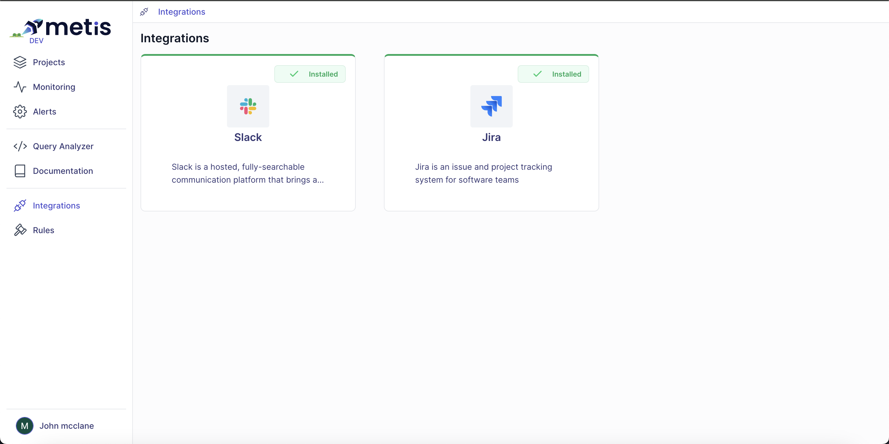

# Notifications

Every alert triggered within Metis is recorded and can be accessed on the "Alerts" page. However, similar to many other alert tools, Metis also has the capability to send notifications to the organization's existing notification system. These notifications typically include basic contextual information along with a link to the corresponding alert for more detailed information.

## Configura a Notification 

The configuration of the Notification is done in two steps:

1. Configure the integration (done once)
2. Configure the exact notification channel of each Rule

:::note
❗ As of Mar 24' only Slack and Jira are supported. More integrations coming soon
:::

## Configure the Notifications Integrations 
Open the page [app.metisdata.io/integrations](http://app.metisdata.io/integrations). Select the integration and follow the instructions. This step done only once. 

## Send a Notification
Each rule within Metis configures its own notifications.
- Slack: configure the channel
- Jira: configure the workspace, project and assignee. 

To stop people from getting too many alerts, the system won't send the same alert again. If the rule's status returns to OK and the alert fires again, a new notification will be sent. For example, if the "High CPU" alert fired at 10:00 and then again at 10:01, 10:02, ..., until 10:15, only one notification will be sent. The "Alerts" page logs the status evaluated every minute. On this page, you can observe how many times the alert has been triggered.