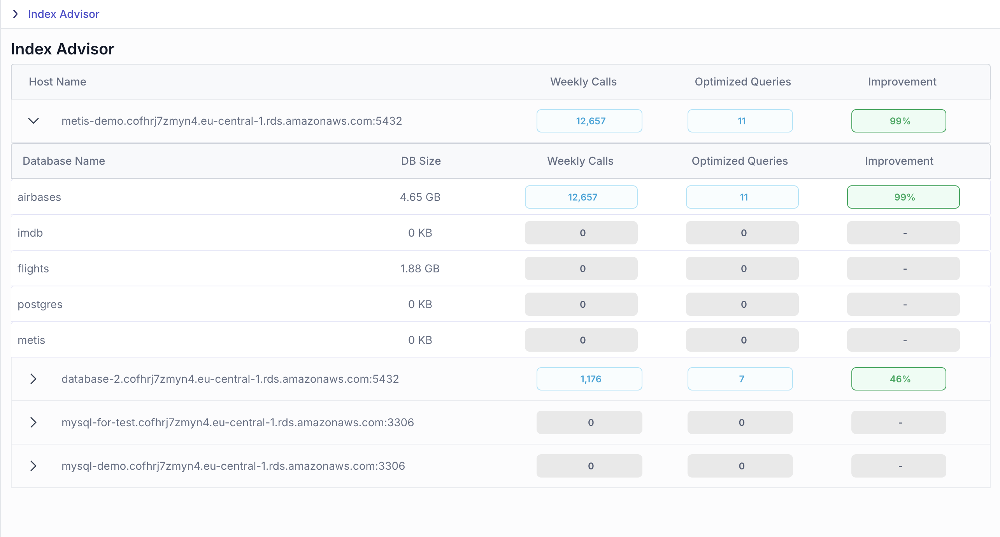

# Overview: Index Advisor
The Index Advisor is a powerful feature designed to optimize query performance on monitored PostgreSQL servers. It provides actionable recommendations for creating new indexes based on a detailed analysis of query execution statistics and costs. By identifying opportunities for performance improvement, the Index Advisor helps users implement indexes that can deliver measurable benefits, including faster query response times and reduced resource usage.

With its data-driven approach, the Index Advisor empowers database administrators and developers to make informed decisions about indexing strategies, streamlining the process of performance tuning for PostgreSQL environments.

The Index Advisor provides insights into index usage over the last 7 days and analyzes execution plans to suggest improved indexing strategies.  
 
 Currently, this feature is available exclusively for PostgreSQL.

