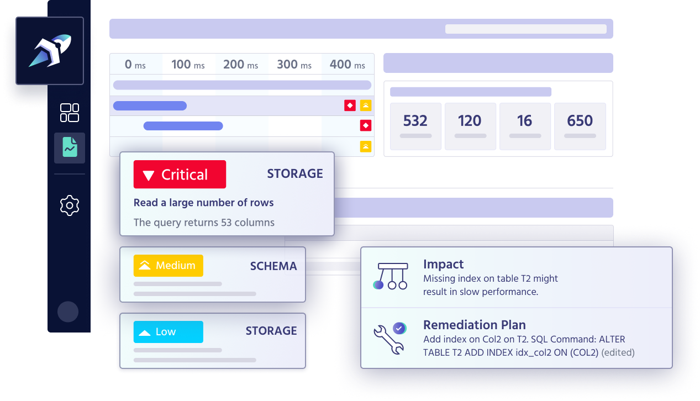
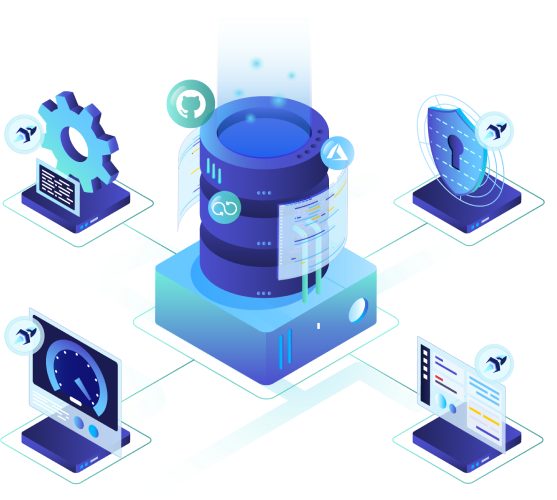
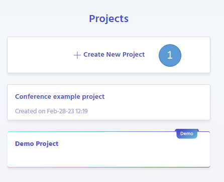
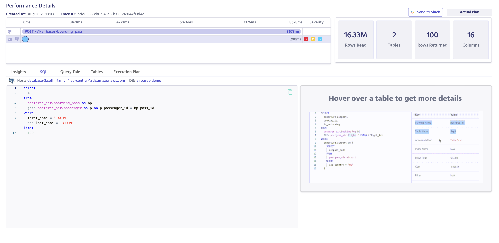

# Quickstart!

---

# About Metis solution

Metis covers all your database needs, from development to production. Prevent slow queries, outages and data loss right from dev or staging environments. Troubleshoot and optimize your production database
in seconds. Never worry about your database again.



Metis natively integrates to the modern (GitOps) SDLC. Metis provides a holistic solution for every aspect of the database-related development, observability and troubleshooting.

## Metis helps you to:

- Prevent the bad code from reaching your production environments;
- Monitor all your databases and environments;
- Improve the performance, stability, and reliability of your systems;
- Troubleshoot and find the root causes.

Metis focuses on integration with your developer ecosystem, monitoring your databases, and automatically analyzing all the interactions.



## The goal of this tutorial

At the end of this tutorial you will:

- Understand Metis's core components and how they improve your application;
- Know how to interact with Metis;
- Learn how to integrate Metis with your application;
- Get automated insights for your code changes;
- Configure monitoring for your databases.

This guide will give you a foundation to start preventing issues originating from your databases and monitor your databases, and, lastly how to troubleshoot them.

## Creating a project

Metis captures everything under an umbrella called Project. It consists of three parts: recent activity, CI/CD, and observability dashboard.

Let’s start by creating a new project. Go to [Projects](https://app.metisdata.io/projects) and click on **_Create New Project_**:



Enter a project name and click **_Create_**:


Your new project is now created and you should see the dashboard. You can click on the **_API Key_** button to copy the key.


We’ll use the API key later to integrate with our application.

## Prevention - BEFORE the deployment

At the end of this section you’ll be able to see the SQL commands running in your environments, get insights about the performance and potential errors, and understand if it’s safe to deploy changes to production.

You will be able to see SQL commands running on your developer environment:


You will get insights about the performance and potential errors:


You will be able to understand the query details and see how it works behind the scenes:


Let’s start by integrating your application with Metis.

### Integrating Metis

To do that, follow the documentation for the technology stack you have in the [Setup Metis](SetupMetis/SetupMetis.md) section. The steps you need to take come down to:

- Add Open Telemetry dependencies if you don’t have them in your project already;
- Add new Exporter to Open Telemetry to capture signals about REST requests (using our SDK);
- Get execution plans for the SQL queries (using our SDK or by configuring your database, depending on the technology you use);
- Deliver execution plans to Metis (using our SDK or by running Metis Agent, depending on the technology you use).

:::tip
You can also see **[How To Seamlessly Integrate Sequelize with Node.js and JavaScript for Database Monitoring](https://www.metisdata.io/blog/how-to-seamlessly-integrate-sequelize-with-node-js-and-javascript-for-database-monitoring)** blog post taking you step by step through the integration of Sequelize ORM library with Metis platform.
:::

Once you do that, you will see **_Recent Activity_** card in your main project page:


Once you click on it, you will see the list of your endpoints with all the executions captured by Metis:


You can see the HTTP code returned by the network call (1), the duration (2), and the number of insights with their severities (3). Once you click on any of the calls, you will see the insights page:

### Insights page


The main page of the call shows the following parts (see the screenshot above):

1. List of all spans and queries sent within this network call;
2. Tabs showing details of the SQL query;
3. List of insights for the SQL query;
4. Details of a particular insight;
5. Impact of the given insight;
6. Instructions how improve the query.

You can now examine the query and get the actionable results. If you see critical insights, then it is most likely not safe to deploy these changes to production.

If you want to see the query statement, then click on the **SQL** tab:



You can see the query text and how many rows were filtered along the way. You can also see the visualization of the plan by clicking on the **Query Tale**:


This shows you the order and types operations, how many rows were passed between the stages, and other details about the performance. You can click on the **Tables** tab to see the tables included in the query:


This shows the tables, number of extracted rows, which indexes were used, and other metrics. You can also get the raw execution plan by clicking on **Execution Plan**:


This way you can learn all the details about the query, reason about its performance, see how to improve it, and apply corrective actions.

## Prevention - DURING the deployment

At the end of this section you’ll be able to see the SQL commands running in your CI/CD pipeline, get insights about the schema migrations, and understand if it’s safe to deploy changes to production.

You’ll get the list of performance insights and schema migration insights for each pull request:


You’ll also get the insights for the SQL migrations:


Each migration will be automatically analyzed and details will be provided:


### GitHub Actions Integration with Metis

Configure your CI/CD actions the regular way. Create new token in GitHub to be used with Action: go to [GitHub Settings](https://github.com/settings/tokens), generate new token (classic), and assign permissions to workflow:


Configure GitHub Action variables and secrets in your repository to include the token and the Metis API key:


Next, run [Metis Test Action](https://github.com/marketplace/actions/metis-test-suite) in your CI/CD, for example:

```json
name: E2E-TEST-EXAMPLE

on:
 # Run workflow every 6 hours
  schedule:
    - cron: '0 */6 * * *'

jobs:
  build:
    runs-on: ubuntu-latest
    defaults:
      run:
        working-directory: backend
    steps:
      - name: set TAG PR Value step
        id: tag_pr
        uses: metis-data/test-queries-analyzer@v1
        with:
          metis_api_key: ${{ secrets.METIS_API_KEY}}
          github_token: ${{ secrets.GITHUB_TOKEN}}
      - name: checkout
        uses: actions/checkout@v3

      - name: setup-node
        uses: actions/setup-node@v3
        with:
          node-version: 18.x
      - name: test
        env:
          METIS_TAG_PR: ${{ steps.tag_pr.outputs.pr_tag  }}
          METIS_API_KEY: ${{ secrets.METIS_API_KEY}}  #Optional
          DATABASE_URL: ${{ secrets.METIS_E2E_DB_CONNECTION }} #Optional
        # Run your e2e test
        run: npm ci  &&  npm run test-sql-queries
```

Similarly, run the [action to analyze schema migrations](https://github.com/marketplace/actions/analyze-migrations), for example:

```json
on:
      pull_request:
        types: [opened, reopened, edited, synchronize, ready_for_review]

    jobs:
      migrations:
        name: Analyze new migrations
        runs-on: ubuntu-latest
        steps:
          - name: Checkout
            uses: actions/checkout@v3
            with:
              fetch-depth: 0
          - name: Compare migrations
            uses: metis-data/sql-migrations-validator@v1
            with:
              from: ${{ github.event.pull_request.base.sha }}
              to: ${{ github.event.pull_request.head.sha }}
              github_token: ${{ github.token }}
              metis_api_key: <Your Api Key>
```

Once you submit a pull request, you should get comments from Metis:


You can also go to the Metis project page and see the list of pull requests:


You can now dive deep into each migration or test and see how it performed.

## Monitor & troubleshoot - AFTER deployment

At the end of this section you will be able to:

- Analyze your database host metrics;
- Analyze your database metrics;
- Get insights for the schema configuration;
- See the extensions and runtime configuration insights;
- See insights for queries executed in your database;
- Optimize your databases index structure;

### Deploy Metis Agent

To run Metis agent, follow the [🤵🏻‍♂️ Deploy Metis observability Agent](/docs/SetupMetis/Deploy%20Metis%20observability%20Agent/Deploy%20Metis%20observability%20Agent.md) guide. Once you do that, you should see the list of the servers monitored by the Agent:


Once you click on the server, you get the **Server Observability Dashboard**.


The dashboard shows multiple charts: CPU (1), memory (2), throughput (3), active sessions (4), and connections (5). You can also see insights about extensions (6), configuration (7), and details for a specific database.

You can zoom in each chart by clicking on it. You can also modify the time range by dragging the slider:


Once you click on the extensions, you get this:


You can see the list of installed extensions and insights for each one of them requiring attention. When you click on the extension, you get:


You can see the list of insights (1), the impact of each insight (2), and the instruction how to fix that (3).

When you go to configuration, you get a very similar list of configuration keys and insights:


Each insight is presented in a similar manner:


When you go to a database view, you get the database-oriented dashboard:


You can see the transactions (1), rows (2), temporary files (3), cache hits (4). You can also examine table sizes (5), schema insights (6), indexes (7), and queries (8).

After clicking on the **Table Sizes**, you can see the details of each table:


Similarly, you can check your schemas:


Each schema has insights. Once you click on it, you go to a screen that shows the details of the impact and how to fix it:


When you go to indexes, you can see the following:


You can see the index name and other details (1), automated insights (2), and the history of the usage (3). You can click on the insights to get more details:


You can also go to the **Queries:**


The screen shows the query texts (1), number of calls (2), average duration (3), and the insights for each query. Once you click on a query, you get details:


You can see the query text (1), the average duration over time (2), and the number of hourly calls (3). You can also click on **Insights** to get automated recommendations:


# What now?

Congratulations! you just integrated Metis into your platform ! 🎉

This quickstart was used to teach you about Metis core components and how they work, you now know how to interact with Metis platform and integrate it with your application.

**Next steps**

Add [🤘 team members to Metis](/docs/BuildingYourTeam.md)

Dive deeper on Metis capabilities at:

- [🚨 Prevent issues on your database](/docs/Prevent%20Database%20Incidents.md)

- [ 📊 Monitor and troubleshoot databases](/docs/Monitor%20and%20troubleshoot%20databases.md)
