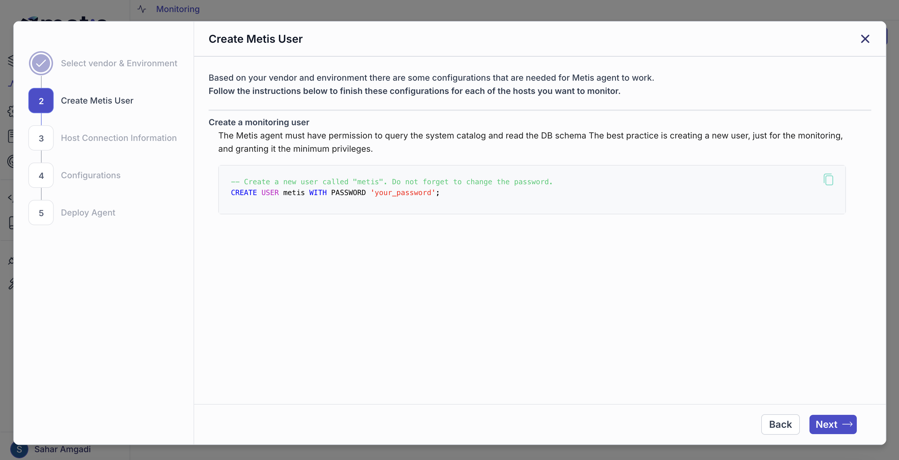
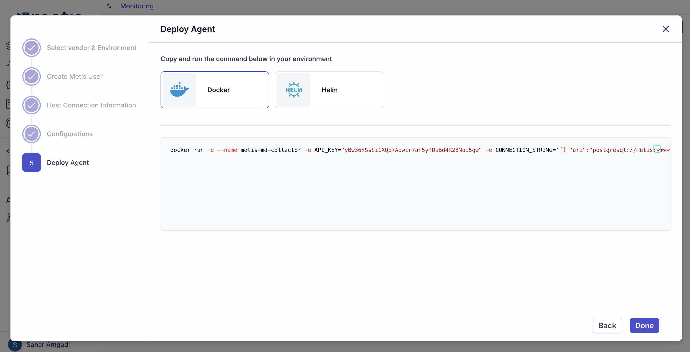

# Quickstart!
Welcome to Metis! In this brief tutorial, we’ll walk you through the essential steps to set up your Metis account and demonstrate how to monitor a PostgreSQL server using the Metis Metadata Collector (MMC). The process for MySQL is very similar, so you can apply these instructions to either database. Let’s dive in!

## Create a New Metis account
The first step is creating an account. The account will be used to generate the API keys and store the traces, metrics, and other data sent to the platform. 
 

## Configure Metis Metadata Collector
First, you will need to configure Metis Metadata Collector, a tool that helps collect important information from database servers. It keeps an eye on things like what the database is doing, any changes to the database's structure or settings, and the size of the tables. By tracking these details, Metis Metadata Collector gives administrators and users useful data to understand and improve the performance of their databases. 

The easiest way to configure Metis Metadata Collector is using a **Wizard**. To learn how to use the wizard watch [this video](https://youtu.be/K8yMuhfBGfU) or follow the steps below. 

Go to the page [Monitoring](https://app.metisdata.io/monitoring). Click on the button **Deploy** to open the configuration Wizard.

The first step is to create a dedicated user on the database server, which is considered best practice. This user must be named "metis."

 

Provide the connection details. Since the Metis Agent (MMC) will use the user created in the previous step, you'll need to enter the password you just set and click **Next**.

You now have the option to collect metrics stored in CloudWatch that are not available in the database engine, such as CPU usage, free memory, and free storage. To enable this, configure the AWS credentials for CloudWatch.

In this step, you need to run a script that creates the required objects on the database server and grants the minimum permissions necessary for the agent to collect data.

The agent has generated a Docker Run or HELM script for deployment. You can now execute the agent and review the logs to ensure everything is functioning as expected.

Docker: 

HELM: 

:::note
❗ It might take 2-3 minutes to see the data.
:::
  
Go back to the page [Monitoring](https://app.metisdata.io/monitoring). The new monitored database server can be found there.
